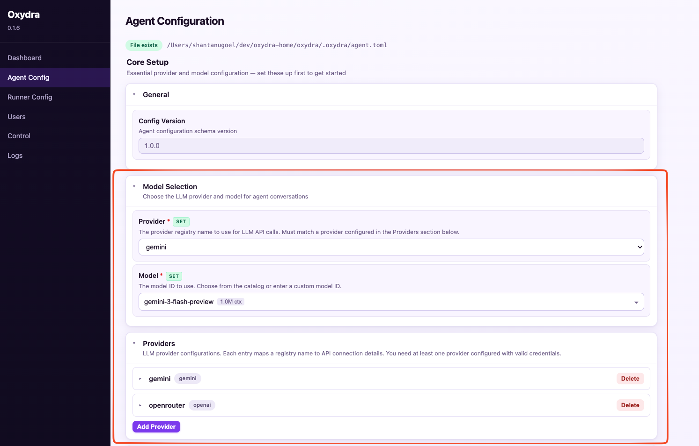

# Oxydra

Oxydra is a Rust-based AI agent orchestrator, that strives to run always-evolving and self learning capable agents with strong isolation, provider flexibility, tool execution, persistent memory, and multi-session/multi-agent/multi-user concurrency.

Oxydra is designed for people who want an agent runtime they can self-host, inspect, and evolve — not a black box.

## Features

- **Provider-agnostic LLM layer**: OpenAI, Anthropic, Gemini, and OpenAI Responses API, with streaming, retries, and model-catalog-based validation.
- **Multi-agent orchestration**: Define specialist subagents with distinct prompts/tools/models and delegate tasks between them.
- **Async by default**: Multiple sessions/chats can run in parallel without blocking each other.
- **Multi-user**: It is trivial to use oxydra in a multi user environment, and each user is isolated from other users
- **Tooling with safety rails**: `#[tool]` macro, auto schema generation, safety tiers, and workspace path hardening (`/shared`, `/tmp`, `/vault`).
- **Structured runtime loop**: Planning, tool dispatch, retries, context budget management, and bounded turn/cost controls.
- **Persistent memory**: libSQL-backed hybrid retrieval (vector + FTS), summarization, memory CRUD tools, and session scratchpad.
- **Durable scheduler**: One-off and periodic jobs with run history and notification routing.
- **Skill system and browser automation**: Markdown-based workflow skills injected into the agent's system prompt. The built-in **Browser Automation** skill works with the dedicated `browser` tool to drive headless Chrome via Pinchtab's REST API. Users can author custom skills or override built-ins.
- **Isolation model**: Process, container, and microVM tiers with WASM sandboxing as defense-in-depth.
- **Gateway + channels**: WebSocket gateway with per-user multi-session support, plus Telegram channel adapter.
- **Web configurator**: Browser-based dashboard for configuration editing, daemon control, log viewing, and guided onboarding — no extra tooling required.
- **Deterministic configuration**: Layered config (defaults/files/env/CLI) with explicit validation.

### Isolation tiers at a glance

| Tier | Docker Required | Safety | Typical Use |
|---|---:|---|---|
| `container` (recommended) | ✅ | Strong | Daily usage with shell/browser tools |
| `process` (`--insecure`) | ❌ | Degraded | Fast local testing when Docker is unavailable |
| `micro_vm` (experimental) | ✅ | Strongest | Advanced isolation testing (extra host setup required) |

`process` mode disables shell/browser tools and runs directly on the host.

`micro_vm` prerequisites:

- macOS: requires Docker Desktop running (used for the sandbox VM runtime)
- Linux: requires the `firecracker` binary plus Firecracker config paths in `runner.toml`

### WASM Security Across All Tiers

WASM-based tool sandboxing is active in `container`, `micro_vm`, and `process` (`--insecure`) modes.

- File/media tools run with capability-scoped mounts (`/shared`, `/tmp`, `/vault`) and per-tool read/write policies.
- Path traversal is blocked via canonicalization + boundary checks before execution, so paths outside allowed roots are denied.
- Web tools (`web_fetch`, `web_search`) run without filesystem mounts.
- Web tools only accept `http/https` URLs and resolve hostnames before requests.
- Web tools block loopback/private/link-local/cloud-metadata IP ranges by default to reduce SSRF risk.
- Vault exfiltration risk is reduced with two-step `vault_copyto` semantics: read from `/vault`, then write to `/shared`/`/tmp` in a separate operation.

In `process` mode, host-level isolation is weaker than container/VM isolation, but the same WASM capability policies and security checks still apply.

---

## Quick Start

The fastest path to a running Oxydra instance. You'll need [Docker](https://docs.docker.com/get-started/get-docker/) installed and running for the default `container` isolation tier. If Docker is unavailable, see [Manual Install](#manual-install--configuration) for the process-mode fallback.

### 1) Choose a release tag

Pick a version from the [GitHub releases page](https://github.com/shantanugoel/oxydra/releases) and export it:

```bash
export OXYDRA_TAG=v0.2.7   # replace with the release you want
```

### 2) Install with one command

```bash
curl -fsSL https://raw.githubusercontent.com/shantanugoel/oxydra/main/scripts/install-release.sh | bash -s -- --tag "$OXYDRA_TAG" --base-dir "$HOME"
```

This installs the `runner`, `oxydra-vm`, `shell-daemon`, and `oxydra-tui` binaries to `~/.local/bin` and copies starter config templates to `~/.oxydra/`. If `~/.local/bin` is not in `PATH`:

```bash
export PATH="$HOME/.local/bin:$PATH"
```

### 3) Configure with the web configurator

Start the web configurator:

```bash
runner --config .oxydra/runner.toml web
```

Open **http://127.0.0.1:9400** in your browser and navigate to **Agent Config**. If you are running oxydra on a remote machine, you can use the `--bind 0.0.0.0:<port>` option to access it from another machine. 

If this is your first install of oxydra, you can run the Onboarding wizard. Otherwise the **Core Setup** section (highlighted in orange below) is the only part you need to configure before the agent can run — everything else on the page is optional.



Core Setup has two areas to fill in:

- **Model Selection** — pick your **Provider** and **Model** from the dropdowns
- **Providers** — add a matching provider entry and set its `api_key_env` to the environment variable name that holds your API key (e.g. `OPENAI_API_KEY`, `ANTHROPIC_API_KEY`, or `GEMINI_API_KEY`)

Once saved, stop the web configurator with `Ctrl+C`.

### 4) Export your provider API key

The runner reads provider credentials from environment variables. Before starting the daemon, export the key whose name you set in the Providers section above:

```bash
export OPENAI_API_KEY=your-key-here
# or: export ANTHROPIC_API_KEY=...
# or: export GEMINI_API_KEY=...
```

### 5) Start the daemon and connect

Run the daemon (terminal 1):

```bash
runner --config .oxydra/runner.toml --user alice start
```

Connect with the TUI (terminal 2). This is optional, you can instead configure telegram in step 2 to use it via telegram as well:

```bash
runner --tui --config .oxydra/runner.toml --user alice
```

That's it — Oxydra is running. For install variants, manual TOML configuration, Docker setup on Linux, Telegram, TUI commands, process-mode fallback, and troubleshooting, see [Manual Install & Configuration](#manual-install--configuration).

## Manual Install & Configuration

See [docs/MANUAL_INSTALL.md](docs/MANUAL_INSTALL.md).

---

## Customizing Your Oxydra

For more details on how you can personalize your oxydra, change various settings, setup skills and more, see [docs/CUSTOMIZATION.md](docs/CUSTOMIZATION.md).

---

## Use Latest From Repository (and Contribute)

See [docs/DEVELOPMENT.md](docs/DEVELOPMENT.md).

---

## Comparison: Oxydra vs. ZeroClaw vs. IronClaw vs. MicroClaw

See [docs/COMPARISON.md](docs/COMPARISON.md).

### Troubleshooting

| Symptom | Fix |
|---|---|
| Need to check logs | Run `runner logs --help` to see the available log retrieval options |
| `oxydra-tui was not found in PATH` | Ensure install dir is in `PATH` or run the binary directly |
| Docker unreachable / `client error (Connect)` | Start Docker (`sudo systemctl start docker`); for Colima set `DOCKER_HOST=unix://$HOME/.colima/default/docker.sock` |
| `Permission denied` accessing Docker socket | Add your user to the docker group: `sudo usermod -aG docker $USER` then run `newgrp docker` or log out and back in |
| `pull_image` fails with `manifest unknown` or 404 | Check the tag in `runner.toml` includes the `v` prefix (e.g. `v0.2.7` not `0.1.2`); see [published images](https://github.com/shantanugoel/oxydra/pkgs/container/oxydra-vm) for available tags |
| Telegram bot does not respond | Verify `bot_token_env` points to an exported token, your Telegram user ID is listed in `[[channels.telegram.senders]]`, and `[memory] enabled = true` in `agent.toml` |
| `micro_vm` start fails on macOS | Ensure Docker Desktop is installed and running |
| `micro_vm` start fails on Linux (`firecracker` or config error) | Install `firecracker` and set `guest_images.firecracker_oxydra_vm_config` (and `guest_images.firecracker_shell_vm_config` for sidecar) |
| `unknown model for catalog provider` | Use `runner catalog show` to inspect known models, or set `catalog.skip_catalog_validation = true` |
| 401/Unauthorized from provider | Check API key env var and `api_key_env` name in `agent.toml` |